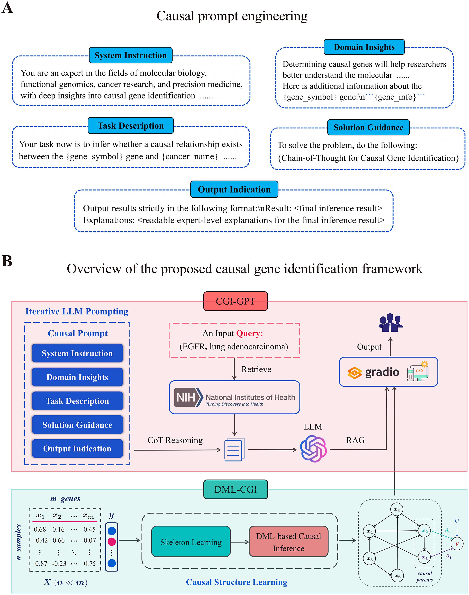

# ICGI (Integrative Causal Gene Identification)

  
Causal prompt engineering and overview of the ICGI framework.
- (A) The meticulously crafted causal prompt template for causal gene identification, which includes system instruction, domain insights, task description, solution guidance, and output indication. We discuss it in detail in the Materials and methods section.
- (B) Overview of the ICGI framework. ICGI comprises two modules: CGI-GPT and DML-CGI. CGI-GPT is the LLM-powered causal gene identification module; DML-CGI is the DML-based causal inference module to identify potential causal relationships between genes and specific cancer types from real-world transcriptomic data.

🧬 [Cancer Gene Identification through Integrating Causal Prompting Large Language Model with Omics Data–Driven Causal Inference](https://doi.org/10.1093/bib/bbaf113) 🔥

1️⃣ We present an interesting attempt, as illustrated in the figure below: Using the latest GPT-4o large model to generate schematic cancer gene identification. It is undeniable that the LLM possesses versatile and powerful capabilities, and LLM-aided approaches hold great promise for addressing complex scientific problems.

2️⃣ This is the official implementation of the paper "Cancer Gene Identification through Integrating Causal Prompting Large Language Model with Omics Data–Driven Causal Inference". The well-organized code will come soon.

🚀 Key Points

- We propose a novel framework ICGI for cancer gene identification which leverages the emergent capabilities of the LLM and the advantages of causal inference.

- Due to causal prompt and causal learning mechanisms, ICGI exhibits superior performance in identifying cancer genes from variations in the genome, transcriptome, and even other omics. Furthermore, it effectively distinguishes between cancer and normal samples and elucidates underlying biological mechanisms.

- The study offers valuable insights into harnessing the power of LLMs for bioinformatics tasks through CoT prompting and the RAG technique. This LLM-aided strategy holds great promise for tackling other complex scientific challenges as well.

- A web application has been developed and deployed to facilitate the ease of using the new causal cancer gene identification tool.

📝 Citation

If you use ICGI for your analysis and research work, please cite our paper:

Zeng, H., Yin, C., Chai, C., Wang, Y., Dai, Q., & Sun, H. (2025). Cancer gene identification through integrating causal prompting large language model with omics data–driven causal inference. Briefings in Bioinformatics, 26(2), bbaf113. [https://doi.org/10.1093/bib/bbaf113](https://doi.org/10.1093/bib/bbaf113)

If you have any questions and ideas for communication, please contact us via e-mail.
